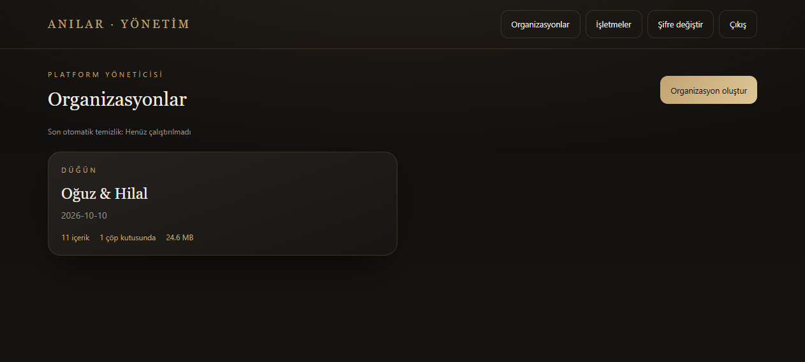
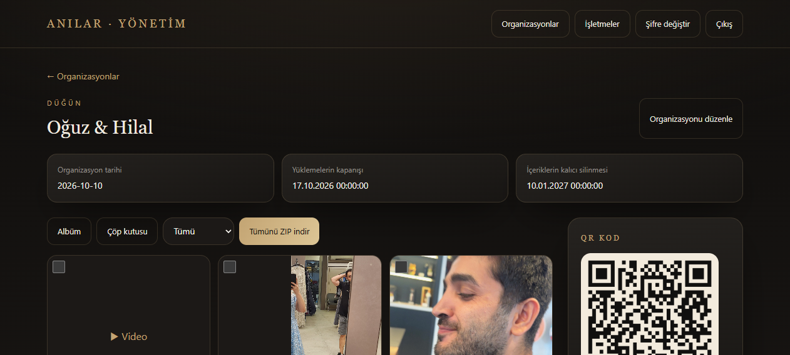
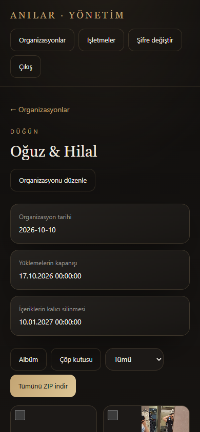
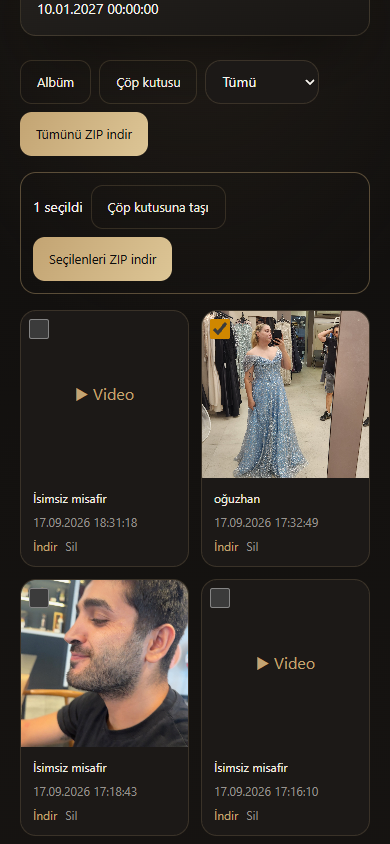
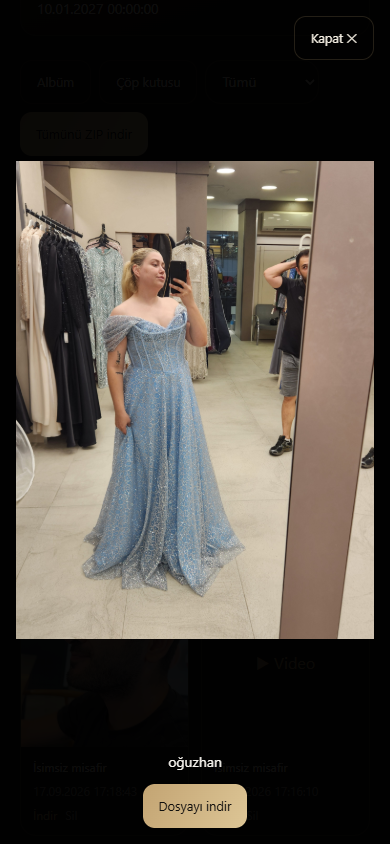
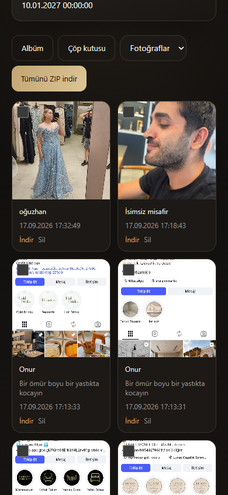
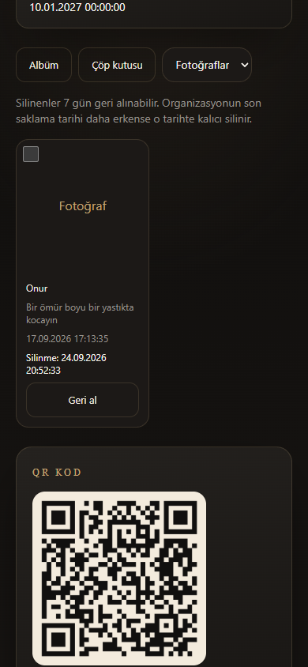

# Yönetim paneli UI/UX incelemesi

17 Eylül 2026. Kaynak: kullanıcının ekran görüntüsü, bu incelemede canlı siteden alınan ekranlar ve mevcut kaynak kodu. Platform yöneticisi hesabıyla organizasyon listesi ve albüm incelendi. Masaüstü ekranı ve 390×844 mobil viewport kullanıldı. Mobil cihaz emülasyonu gerçek telefon testi değildir.

## Genel değerlendirme

Koyu/krem/altın görsel kimlik tutarlı. Özel albüm, filtre, tekli/toplu işlem ve geri alma için temel yapı mevcut. Öncelikli ihtiyaç: mobilde albüme ulaşmayı hızlandırmak, işlem kapsamını belirginleştirmek ve klavye erişimini düzeltmek.

## Adımlar ve kanıtlar

### 1. Organizasyon listesi — temel kullanım anlaşılır, ölçeklenme zayıf

- İçerik sayısı, çöp kutusu sayısı ve boyut gösteriliyor; oluşturma eylemi belirgin.
- Arama, durum/tarih filtreleme yok. Birçok organizasyonda kartlar taramayı zorlaştıracaktır; bu bir ölçeklenme öngörüsüdür, çoklu organizasyon testi yapılmadı.
- “Son otomatik temizlik: Henüz çalıştırılmadı” küçük, düşük öncelikli metin. Bu API kaydı, başka dış zamanlayıcıların bulunmadığını kanıtlamaz. Sistem sağlığı kartında son başarılı çalışma, uyarı ve açıklayıcı eylem olmalı.

### 2. Masaüstü albüm — çalışır, hiyerarşi geliştirilmeli

- Üç tarih kartı belirgin; toplam fotoğraf, video ve boyut özeti eksik.
- Albüm / Çöp kutusu görünüm seçimi, içerik filtresi ve ZIP eylemi aynı sırada. Aktif Albüm/Çöp kutusu yeterince ayrışmıyor.
- Tarihlerde saniye ve ham YYYY-MM-DD karışımı var. Yerel okunabilir tarih, durum rozeti ve gerektiğinde tam saat kullanılmalı. 17 Ekim 00:00 kapanışı için “16 Ekim gün sonuna kadar” gibi sınırı yanlış uzatmayan metin tercih edilmeli.
- Öneri: başlık ve paylaşım eylemleri; kısa durum özeti; Albüm / Paylaşım ve QR / Ayarlar bölümleri; albüm içinde filtre ve seçim araçları.

### 3. Mobil albüme giriş — yüksek öncelikli iyileştirme

- 390×844 görünümde üst navigasyon üç satır, üç tarih kartı alt alta; ilk medya satırı yaklaşık 792 px'te başlıyor.
- Yatay taşma kontrolünde viewport ve scrollWidth 390 px. Sorun bu görünümde yatay taşma değil, dikey yer kullanımı.
- Kompakt başlık ve hesap menüsü; iki satırlık özet; ayrıntıları açılabilir alana taşıma önerilir. İlk medya satırı hedef cihazda ilk ekranda anlamlı büyüklükte görünmeli.
- Kodda QR/sahip bilgileri albümden sonraki aside içinde; mobilde galeri uzadıkça paylaşım araçlarına erişim zorlaşır. Üstte doğrudan Paylaşım/QR bağlantısı sağlanmalı.

### 4. Medya seçimi — temel çalışır, toplu işlem keşfi zayıf

- Bir dosya seçilince seçilen sayısı ve işlemler geliyor.
- Araç çubuğu sabit değil. Uzun galeride seçilen dosyalar aşağıdayken üstteki işlemlere dönmek gerekiyor.
- Kodda seçim `.slice(0, 200)` ile sessizce kesiliyor. 200/200 açıklaması ve sınır geri bildirimi gerekli.
- Tüm görünenleri seç, seçimi temizle ve mobil sabit seçim çubuğu önerilir.
- Kartlarda 12 px metin, 20×20 seçim kutusu ve küçük İndir/Sil kontrolleri var. Kontrollerin etkileşim alanları büyütülmeli; yıkıcı işlem ayrı menüde ve “Çöp kutusuna taşı” adıyla sunulmalı.
- Video kartları yalnız “Video” yazıyor. Küçük video görseli ve süre önerisi ek medya işleme gerektirir; salt CSS işi değildir.

### 5. Fotoğraf görüntüleme — açılıyor, klavye sorunu doğrulandı

- Görsel açılıyor ve indir bağlantısı var. İlk yakalama yüklenme anı olduğu için reddedilip görsel yüklendikten sonra tekrar alındı.
- İki Tab sonrasında odak BODY'ye çıktı; ardından Escape pencereyi kapatmadı. Kapat düğmesiyle kapanabildi. Kod yalnız dialog içindeki keydown'u dinliyor; odak tutma/giriş-çıkış yönetimi yok.
- Erişilebilir dialog bileşeniyle odak içeride tutulmalı, kapanınca açan karta dönmeli. Önceki/sonraki görsel, sayaç ve mobil kaydırma eklenmeli.
- Ekran okuyucu veya tam erişilebilirlik uygunluk testi yapılmadı.

### 6. Fotoğraf filtresi — filtre çalışıyor, indirme kapsamı belirsiz

- Fotoğraflar seçildiğinde videolar listeden çıkıyor, önceki seçim temizleniyor.
- “Tümünü ZIP indir” aynı kalıyor. Kaynak kodundaki arşiv URL'si tür filtresini taşımıyor; filtrelenmiş içerik yerine tüm albümü indirir. Bu incelemede gerçek ZIP indirilmedi.
- “Albümün tamamını indir” ile “Filtrelenenleri indir” ayrılmalı. Sonuç sayısı ve aktif filtre görünmeli.
- Kodda filtre sonucu boşken de “Henüz içerik yok” mesajı kullanılıyor; filtreyi temizle eylemiyle ayrı boş durum gerekli.

### 7. Çöp kutusu — geri alma bulunabilir, dosyayı tanımak zor

- Saklama açıklaması, kalıcı silinme tarihi ve Geri al düğmesi var.
- Fotoğrafın yerinde “Fotoğraf” yazıyor, önizleme kapalı. Kullanıcı doğru dosyayı geri aldığını kontrol edemiyor.
- Silinme tarihine ek anlaşılır kalan süre ve mümkünse yetkili önizleme gerekli. Önizleme açılması mevcut medya erişim politikasını etkileyebilir; API yetkileri korunarak ele alınmalı.
- Çöp kutusunda da QR/sahip kartları gösteriliyor; görevle ilgisiz içerik ayrı bölüme taşınmalı.

## Önerilen uygulama sırası

1. Mobil başlık/menü/özet; tarih ve durum metinleri; aktif sekme; filtre/indirme kapsamı; seçim sınırı ve daha geniş etkileşim alanları; erişilebilir dialog.
2. Albüm / Paylaşım ve QR / Ayarlar yapısı; sabit toplu işlem çubuğu; görsel gezinme; arama/sıralama; rol bazlı sadeleştirme.
3. Video küçük görselleri ve süreleri; optimize fotoğraf önizlemeleri; sayfalama; büyük ZIP hazırlama durumu ve hata geri bildirimi.

Mevcut krem-altın marka dili korunabilir. Başlıklarda dekoratif serif sınırlı kullanılmalı; çalışma alanında sans-serif, belirgin yüzey ayrımı ve tutarlı boşluklar tercih edilmeli. Bu öneri için yeni tasarım veya uygulama kodu üretilmedi.

## Sınırlar

Platform hesabı kullanıldı; işletme/sahip rolleriyle ayrı canlı oturum açılmadı. Bu rollere dair öneriler kaynak koduna dayanır. İçerik silme/geri alma, düzenleme kaydı ve gerçek arşiv indirme çalıştırılmadı. Kontrast oranı, ekran okuyucu, gerçek iOS/Android ve büyük albüm performansı ölçülmedi. Kullanıcının küçük ekran görüntüsünden piksel boyutu çıkarılmadı; canlı 390 px viewport esas alındı. Ekran görüntüleri yerelde saklandı; uygulama kaynak dosyaları değiştirilmedi.
